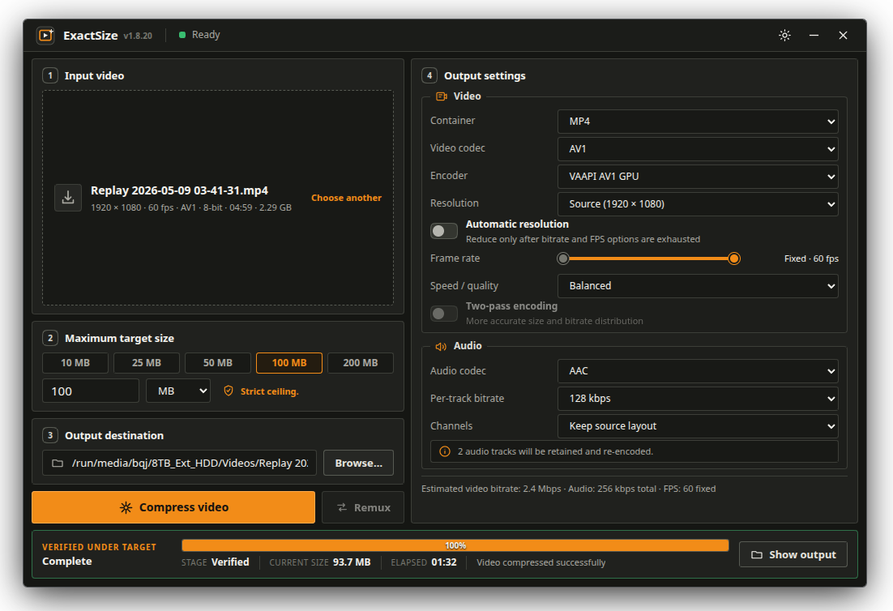

# ExactSize

A local Linux video compressor with one promise: the output is **never larger than the size you set**. Pick a video, a maximum size, and a codec. ExactSize works out the bitrate, encodes, measures the real file, and only saves it once it fits.



## Run it

```bash
chmod +x ExactSize-1.9.8-x86_64.AppImage
./ExactSize-1.9.8-x86_64.AppImage
```

FFmpeg is bundled. On first run the AppImage adds itself to your app menu with its icon.

## Features

- **Strict size ceiling**: packet-aware container overhead is budgeted up front, then encodes are projected and auto-corrected in strict bitrate cycles at maximum FPS → midpoint FPS → minimum FPS → lower resolution order. Low-bitrate GPU attempts are assessed after at most 30 encoded seconds or about one minute of wall time, with a confidence band that accounts for heavier opening scenes; an attempt is stopped and cleaned up once the evidence shows it cannot fit, and an oversized attempt never replaces your output.
- **GPU encoding**: NVENC, Quick Sync, VAAPI, and AMF. Every encoder is test-run at launch, so only ones that actually work on your machine are offered, and they're preferred by default.
- **Modern codecs**: H.264, H.265, H.266/VVC, AV1, VP9. AV2 is wired up and unlocks itself the moment FFmpeg ships an encoder.
- **Quick presets**: one-click size targets (10–200 MB), speed/quality tiers from Fastest to Higher quality, codec-aware per-track audio bitrate and dual-handle 5 fps-to-source adaptive frame-rate sliders, and an independent Automatic resolution toggle that downscales from the selected starting resolution only after all bitrate and FPS options are exhausted.
- **Update checks**: once the app is ready, it checks the latest published GitHub Release and shows a compact header action only when a newer version is available.
- **Single instance**: launching ExactSize while it is already open shows a native warning and exits the new process without spawning another app window or leaving a lock file behind.
- **Remux / Mux**: switch containers losslessly without re-encoding; if only the audio doesn't fit the new container, Mux copies the video untouched and converts just the audio.
- **Drag & drop that behaves**: dropped files keep their real location — checked against your recent-documents history first, then a fast, bounded scan of likely folders and external drives — so outputs land next to the source, not in /tmp.
- **At home on KDE**: frameless window with native drag, resize, and rounded corners.
- **Private by design**: no telemetry, no accounts, and no video uploads. The only outbound request is one public GitHub Release check at startup; all video processing stays local.

## Formats

| Container | Video | Audio |
| --- | --- | --- |
| MP4 | H.264, H.265, H.266, AV1 | AAC, MP3 |
| MKV | H.264, H.265, H.266, AV1, AV2*, VP9 | AAC, Opus, Vorbis, MP3 |
| WebM | AV1, VP9 | Opus, Vorbis |
| MOV | H.264, H.265, AV1 | AAC, MP3 |

*Audio can also be dropped entirely. AV2 stays greyed out until FFmpeg ships an encoder.*

## If a GPU encoder is missing

Most distros strip patented codecs from their stock GPU drivers. Install the full driver and relaunch; encoders are re-detected every start.

| GPU | Distro | Install |
| --- | --- | --- |
| AMD | Fedora | `sudo dnf install mesa-va-drivers-freeworld` ([RPM Fusion](https://rpmfusion.org/Configuration)) |
| AMD | openSUSE | `opi codecs` ([Packman](https://en.opensuse.org/Additional_package_repositories#Packman)) |
| AMD | Ubuntu / Debian / Arch | nothing to install |
| Intel | Fedora | `sudo dnf install intel-media-driver libvpl intel-vpl-gpu-rt` (RPM Fusion) |
| Intel | Ubuntu / Debian | `sudo apt install intel-media-va-driver-non-free libvpl2 libmfx-gen1.2` |
| Intel | Arch | `sudo pacman -S intel-media-driver vpl-gpu-rt` |
| NVIDIA | Fedora | `sudo dnf install akmod-nvidia xorg-x11-drv-nvidia-cuda-libs` (RPM Fusion) |
| NVIDIA | Ubuntu | `sudo ubuntu-drivers install` |
| NVIDIA | Debian / Arch | `sudo apt install nvidia-driver` / `sudo pacman -S nvidia` |

Hardware limits no driver fixes: AV1 encoding needs RX 7000+ / RTX 40+ / Intel Arc; VP9 encoding is Intel-only; no GPU encodes H.266 yet.

## Build from source

Needs Go 1.24+, `curl`, and `tar` with xz support. Everything else (static FFmpeg, appimagetool) is downloaded and checksum-verified automatically:

```bash
./scripts/build-appimage.sh
```

The build embeds GitHub zsync update metadata and produces both release assets:

- `build/ExactSize-<version>-x86_64.AppImage`
- `build/ExactSize-<version>-x86_64.AppImage.zsync`

Upload both files to the matching GitHub Release. Run the tests with `go test ./...`.

For a tagged release, the release helper refuses to publish unless both files exist, uploads them together, and verifies both asset names afterward:

```bash
./scripts/publish-release.sh
```

## License

MIT. FFmpeg is bundled under its own license, see `THIRD_PARTY_NOTICES.md`.
